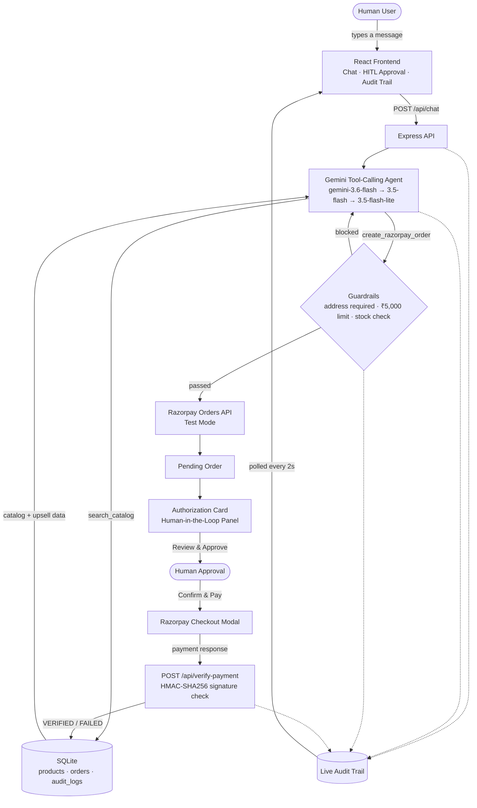

# Nova — Agentic Commerce

**Razorpay Buildathon · Track 1 — AI Growth & Agentic Commerce**

An agentic shopping assistant that can browse a live product catalog and place real Razorpay test-mode orders on a user's behalf — without ever being trusted to complete a payment unsupervised.

---

## About Nova

Handing an AI agent the ability to spend real money is genuinely risky: hallucinated orders, accidental checkouts, and unverified transactions are not hypothetical failure modes, they're the default behavior of an ungoverned tool-calling loop. Nova exists to answer a narrower, harder question than "can an AI shop for you" — it answers "can an AI shop for you *safely enough that a human would actually trust it with their card*."

It does this with three things that are enforced in code, not left to the model's judgment:

1. **Bounded autonomy** — a ₹5,000 autonomous spend cap, a mandatory shipping-address check, and live stock validation, all evaluated inside the tool handler itself before any payment API is ever touched. The agent cannot be prompted around these; they don't live in the system prompt, they live in `toolHandlers.js`.
2. **A human-in-the-loop approval gate** — Nova can generate a pending order, but it can never complete a payment on its own. Every order becomes an interactive authorization card that a human must explicitly review and approve before Razorpay Checkout is even launched.
3. **A real-time, explainable audit trail** — every step of the cycle — user intent, the agent's reasoning, the exact function-call parameters, guardrail decisions, and the cryptographic Razorpay signature verification — is logged and streamed live, so an operator can see exactly what the agent did and why, at any point.

On top of that safety layer, Nova also demonstrates the *growth* half of this track: a conversational interface that collapses browsing and checkout into a single flow, plus a deterministic, data-driven upsell/cross-sell engine that surfaces a real in-stock alternative whenever a product is out of stock, over the spend limit, or low-value — not a scripted demo line, an actual database query run on every catalog lookup.

**Alignment with Track 1's stated bar** — *"Every money action explainable, bounded and gated. Show the audit trail and one failure handled gracefully."* Nova was built directly against this: every money action is explainable (the audit panel), bounded (the three code-level guardrails), and gated (the authorization card); the audit trail isn't an afterthought, it's a first-class panel; and Nova handles three separate failure modes gracefully, not just one.

---

## Demo Video

> 🎥 **[Watch the demo video](#)** *(link to be added)*

*A walkthrough of Nova handling product discovery, all three guardrails, the human-in-the-loop approval flow, a real Razorpay test-mode payment, and the live audit trail.*

---

## System Architecture



**Request flow, step by step:**

1. The user sends a message from the chat panel; it's added to the conversation and posted to `/api/chat`.
2. The Express backend hands the full conversation to a Gemini tool-calling agent, configured with two tools: `search_catalog` and `create_razorpay_order`.
3. `search_catalog` is read-only and queries SQLite directly — no guardrails needed, since it can't spend money. Its results also carry a deterministic upsell/cross-sell suggestion computed from real catalog data.
4. `create_razorpay_order` is where every guardrail lives: missing address, spend limit, and stock are all checked in code, in that order, before a real Razorpay order is ever created. Any failure returns a structured error — with a suggested alternative embedded directly in the message — that the agent relays back to the user.
5. If every guardrail passes, a real order is created via the Razorpay Orders API (Test Mode) and persisted locally — but it is **not** paid for yet.
6. The pending order surfaces as an interactive **Authorization Card** in the Human-in-the-Loop panel. Nothing proceeds without an explicit human "Review & Approve."
7. Approval launches the official Razorpay Checkout modal. The resulting payment response is posted to `/api/verify-payment`, which independently recomputes the HMAC-SHA256 signature (constant-time comparison) rather than trusting the client — a forged or failed signature restores the reserved stock automatically.
8. Every step above — not just the successful path — is written to `audit_logs` and streamed to the Explainable AI Audit Trail panel, polling every 2 seconds, categorized into User Input, Agent Reasoning, Tool Calls, Razorpay API events, and Guardrail/Errors.

**Monorepo layout:**

```
agentic-commerce/
├── backend/
│   ├── agent/
│   │   ├── agent.js          # Gemini tool-calling loop, model fallback chain, system prompt
│   │   ├── tools.js          # Tool declarations (search_catalog, create_razorpay_order)
│   │   └── toolHandlers.js   # Guardrails, upsell/cross-sell engine, Razorpay order creation
│   ├── lib/
│   │   ├── audit.js          # Audit log read/write
│   │   └── razorpay.js       # Razorpay SDK client
│   ├── routes/
│   │   ├── chat.js           # POST /api/chat
│   │   ├── auditTrail.js     # GET  /api/audit-trail
│   │   └── verifyPayment.js  # POST /api/verify-payment
│   ├── db.js                 # SQLite schema (products, orders, audit_logs)
│   ├── seed.js                # Seeds the demo catalog
│   ├── server.js              # Express app, serves the built frontend in demo mode
│   └── test-runner.js         # Live integration test suite (guardrails + happy path)
└── frontend/
    └── src/
        ├── components/        # ChatPanel, HitlPanel, AuditPanel, OrderAuthorizationCard, ...
        ├── lib/                # API + Razorpay Checkout wrappers
        └── utils/              # Audit-log classification, order derivation, formatting
```

---

## UI Screenshot

> 📸 *Screenshot of the three-panel dashboard to be added here.*

<!-- Attach a screenshot of the Chat / Human-in-the-Loop / Audit Trail panels below -->

---

## Key Features & Technical Guardrails

### Key Features

- **Conversational catalog discovery** — natural-language product search backed by real SQLite queries, never invented data.
- **Guarded, agentic checkout** — the agent can initiate a purchase, but never finalize a payment on its own.
- **Human-in-the-loop authorization** — every order is a pending, reviewable card until a human explicitly approves it.
- **Real Razorpay Test Mode integration** — genuine Razorpay orders, genuine Checkout modal, genuine HMAC signature verification — nothing mocked.
- **UPI support** — Razorpay Checkout is configured with UPI enabled alongside card/netbanking/wallet.
- **Live, explainable audit trail** — every user message, model decision, tool call, guardrail block, and payment verification is logged and streamed in real time, filterable by category.
- **Deterministic upsell/cross-sell engine** — a real database query, not a prompt hope, surfaces an in-stock alternative whenever a product is unavailable, over budget, or low-value.
- **Automatic model fallback** — if the active Gemini model is rate-limited, overloaded, or times out, the agent transparently falls back to the next model in the chain and logs the switch to the audit trail.

### Technical Guardrails

All three are enforced inside `toolHandlers.js`, evaluated in this order, before any Razorpay API call is made:

| # | Guardrail | Trigger | Enforced by |
|---|---|---|---|
| 1 | **Address required** | No shipping address has been provided in the conversation | Code — the tool handler rejects the call outright |
| 2 | **Spend limit** | Order total exceeds **₹5,000** | Code — a hardcoded ceiling (`SPEND_LIMIT_PAISE`), not a suggestion in the prompt |
| 3 | **Stock check** | Requested quantity exceeds available stock | Code — checked against the live `products` table |

Every guardrail failure returns a structured error (`ADDRESS_REQUIRED`, `SPEND_LIMIT_EXCEEDED`, `OUT_OF_STOCK`, plus defensive handling for `PRODUCT_NOT_FOUND` and `RAZORPAY_ERROR`) with a concrete alternative suggestion embedded directly in the message text, and every block is written to the audit trail as a `GUARDRAIL_BLOCK` event.

**Payment integrity:** `/api/verify-payment` never trusts the client's claim that a payment succeeded. It independently recomputes `HMAC-SHA256(order_id|payment_id, key_secret)` and compares it using a constant-time comparison (`timingSafeEqual`) to prevent timing attacks. A failed or forged signature marks the order `FAILED` and automatically restores the reserved stock.

**Resilience:** each Gemini call is bounded by a 20-second timeout. On a rate limit (`429`), an overloaded model (`503`), a server-side deadline (`504`), or a client-side timeout, the agent automatically cascades to the next model in `gemini-3.6-flash → gemini-3.5-flash → gemini-3.5-flash-lite`, without ever surfacing a raw provider error to the user.

---

## Tech Stack

| Layer | Technology |
|---|---|
| **Agent / LLM** | Google Gemini (`@google/genai`), structured function calling, automatic model fallback |
| **Backend** | Node.js, Express |
| **Database** | SQLite (`better-sqlite3`) |
| **Payments** | Razorpay Orders API + Checkout (Test/Sandbox Mode) |
| **Frontend** | React 18, Tailwind CSS v4, Vite |
| **Testing** | Custom zero-dependency integration test runner (live guardrail + happy-path tests) |
| **Tooling** | npm workspaces monorepo (`backend/` + `frontend/`) |

---

## Quick Start & Installation

### Prerequisites

- **Node.js** — one of `20.x`, `22.x`, `23.x`, `24.x`, `25.x`, or `26.x`
- **npm** (ships with Node)
- A **Google Gemini API key** — free at [aistudio.google.com/apikey](https://aistudio.google.com/apikey)
- **Razorpay Test/Sandbox mode keys** — from the [Razorpay Dashboard](https://dashboard.razorpay.com/) → Settings → API Keys

### Installation

1. **Clone or unzip the project**, then move into the root folder:
   ```bash
   cd agentic-commerce
   ```

2. **Install all dependencies** (installs both `backend/` and `frontend/` via npm workspaces in one command):
   ```bash
   npm install
   ```

3. **Configure environment variables:**
   ```bash
   cp backend/.env.example backend/.env
   ```
   Then fill in `backend/.env`:
   ```
   GEMINI_API_KEY=your-gemini-key
   RAZORPAY_KEY_ID=rzp_test_your-key-id
   RAZORPAY_KEY_SECRET=your-key-secret
   ```

4. **Seed the demo catalog:**
   ```bash
   npm run seed
   ```

5. **Run the app** — pick one:

   **Single-server mode (recommended for judging):** builds the frontend and serves everything — UI and API — from one port.
   ```bash
   npm run demo
   ```
   → **http://localhost:4000**

   **Development mode:** two servers with hot reload — backend on `:4000`, Vite dev server on `:5173` proxying API calls.
   ```bash
   npm run dev
   ```
   → **http://localhost:5173**

6. **(Optional) Run the test suite** — in a second terminal, while the server from step 5 is running:
   ```bash
   npm test
   ```
   Runs a live integration suite against the four core scenarios: a full happy-path purchase, a missing-address block, a spend-limit block, and an out-of-stock block.

---

## Core Demo Scenarios

Everything below can be reproduced live, not just watched in the video — try these directly in the chat panel.

| Scenario | Try asking | What to expect |
|---|---|---|
| **Out-of-stock guardrail** | *"Buy a desk pad"* | Nova declines — the Desk Pad has 0 stock — and, in the same message, suggests an in-stock alternative pulled from a real database query. |
| **Spend-limit guardrail** | *"Buy the UltraWide Curved Monitor"* | Priced at ₹18,500, well over the ₹5,000 autonomous spend cap. Nova blocks the order and suggests an alternative that's within budget — without ever calling the payment API. |
| **Address validation gate** | *"I want to buy an Ergonomic Mouse"* (without giving an address) | Nova recognizes the missing shipping address and asks for it directly, rather than firing an incomplete order. |
| **Human-in-the-loop approval + real payment** | Provide an address after the above | Nova creates a real, pending Razorpay order and pushes an Authorization Card — locked until you click **Review & Approve**, then **Confirm & Pay**, which launches the actual Razorpay Checkout modal. |
| **Cross-sell / upsell** | Ask for any low-priced or out-of-stock item | A concrete, in-stock, budget-respecting alternative is suggested — computed from real data, not improvised. |
| **Live audit trail** | Watch the right-hand panel during any of the above | Every user message, agent decision, tool call, guardrail block, and signature verification appears in real time, filterable by category, with the full raw JSON payload available on demand. |

**Testing UPI in Razorpay Checkout (Test Mode):** use the UPI ID `success@razorpay` to simulate a successful payment, or `failure@razorpay` to simulate a failed one.

---

## Engineering Notes

A few real problems came up during development that are worth being upfront about, since they shaped some of the design decisions above:

- **A mid-build model deprecation.** Google retired `gemini-2.0-flash` mid-development with a 404 pointing at `gemini-3.6-flash` — which also changed the function-calling contract (`parameters` now expects an uppercase `Schema` type; plain JSON Schema needs the `parametersJsonSchema` field instead). This is why tool declarations use `parametersJsonSchema`, and part of why model resilience became a first-class feature rather than a hardcoded model string.
- **A native-module compatibility gap.** `better-sqlite3` ships prebuilt binaries per Node ABI version; the version originally pinned had no prebuild for newer Node releases, which would silently force a from-source compile (and fail outright on a machine without Python/a C++ toolchain). Pinned to a version with an explicitly wide supported range (`20.x` through `26.x`) instead.
- **Guardrail suggestions needed to live in message text, not a side field.** An early version of the upsell engine attached a suggestion as a separate structured field and instructed the model to mention it — which proved unreliable in practice. Suggestions are now embedded directly into the guardrail message text itself, reusing the same channel that guardrail explanations were already proven to relay faithfully.

---

## Author

**Tanmay Raj** — built for the Razorpay Buildathon, Track 1 (AI Growth & Agentic Commerce).